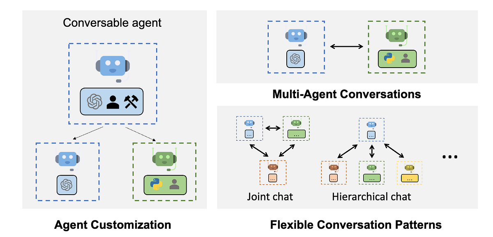
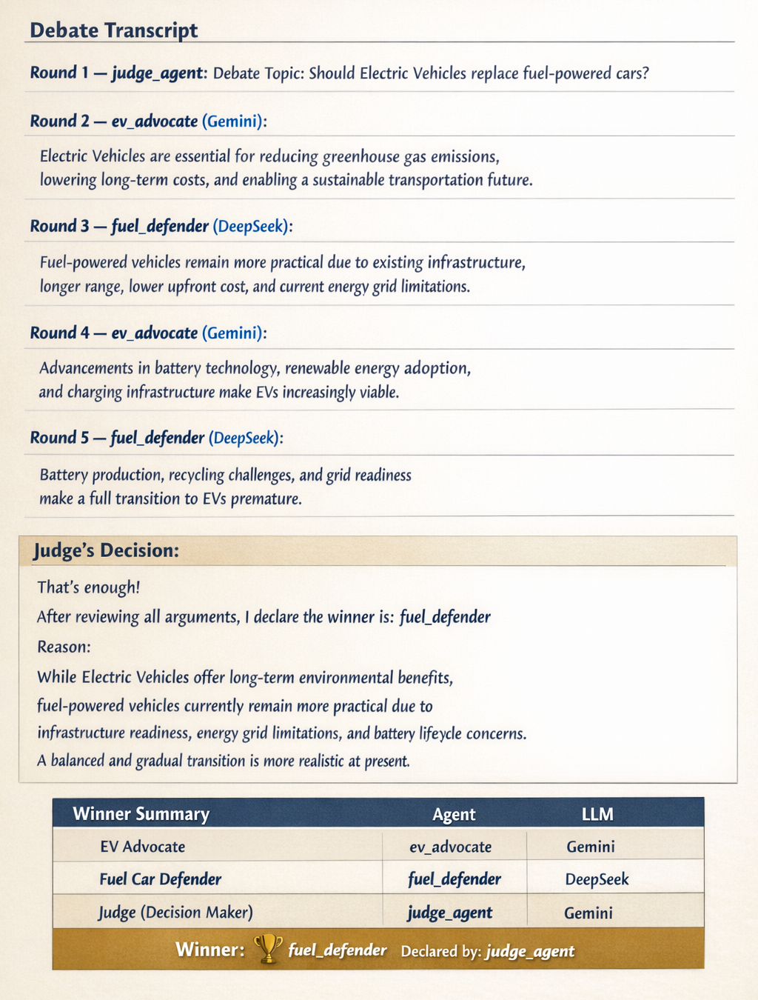

# 🤖 Cross-Model AI Debate and Reasoning Framework :- Electric Vehicles vs Fuel Cars                                 
 
This project demonstrates how to simulate a structured debate between two AI agents using [AutoGen](https://github.com/microsoft/autogen). The topic of the debate is: 
 
> **Should Electric Vehicles (EVs) replace fuel-powered cars?**       
      
Agents are powered by two different LLM APIs:    
- `ev_advocate` (Gemini - Google)      
- `fuel_defender` (DeepSeek Chat)  
- `judge_agent` moderates the discussion and declares the winner (Gemini)

---

## 🧠 What’s Inside

-  Multi-agent setup using `AutoGen`
-  Uses both **Gemini API** and **DeepSeek API**
-  Judge agent enforces debate structure and declares the winner using `"That's enough!"`
-  Supports retries and wait time to avoid rate-limit issues
-  Displays full debate transcript round-by-round

---

## 🚀 How to Run

### 📌 Prerequisites

- Python 3.8+
- Google Colab **or** any Jupyter Notebook
- `GEMINI_API_KEY` from [Google AI Studio](https://makersuite.google.com/app/apikey)
- `DEEPSEEK_API_KEY` from [DeepSeek Developer Console](https://platform.deepseek.com/)
- 

### 🛠️ Installation

Install the required Python packages:

```bash
pip install pyautogen
pip install python-dotenv
```

> On Google Colab, these are included in the script already.

---

### 🔐 Set API Keys (for Colab)

```python
import os
from google.colab import userdata

os.environ['GEMINI_API_KEY'] = userdata.get('GEMINI_API_KEY')
os.environ['DEEPSEEK_API_KEY'] = userdata.get('DEEPSEEK_API_KEY')
```

> 🔐 Store your API keys in Colab under Runtime → Manage Environment Secrets.

---

### ▶️ Run the Debate
 
Use the following command to run:

```python
judge_agent.initiate_chat(...)
```

This triggers the debate, and the `judge_agent` will orchestrate the interaction until a winner is declared by saying:

```text
"That's enough!"
```

You’ll get a full transcript like this:



---

## 🧾 Output Sample

```
🔹 Round 1 — judge_agent:
Debate: Should Electric Vehicles replace fuel-powered cars?

🔹 Round 2 — ev_advocate:
Electric vehicles are key to fighting climate change...

🔹 Round 3 — fuel_defender:
Fuel cars remain superior in range, performance, and infrastructure...

🔹 Round 7 — judge_agent:
That's enough! After reviewing all arguments, I declare the winner is...
```

---

## 📁 Folder Structure

```
/electric-vs-fuel-ai-debate
│
├── debate_notebook.ipynb      
├── README.md                   
└── /screenshots                
    └── debate_sample.png
```

---

## 🤝 Credits

- [AutoGen by Microsoft](https://github.com/microsoft/autogen)
- [Gemini by Google AI](https://ai.google.dev/)
- [DeepSeek AI](https://platform.deepseek.com/)

---

## 📜 License

MIT License
